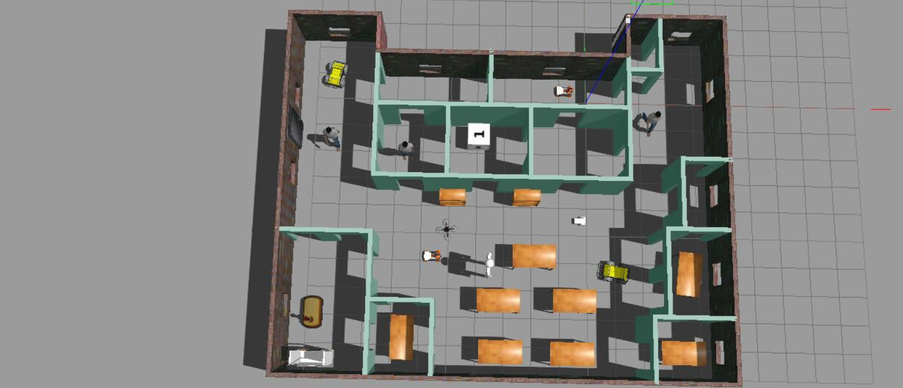

# Build_My_World_ROS

## Project Aim:

1. To build a single floor wall structure with models and robots in Gazebo.

2. Modelling a robot with links connected to joints in Gazebo.

3. Importing wall structure and two instances of the created models of robot inside an empty Gazebo World.

4. Writing C++ World Plugins to interact with the above created world.

## Instructions to download and run the project:

1. Make sure you have a stable version of gazebo downloaded and running (Gazebo Tutorials: http://gazebosim.org/tutorials?cat=guided_b&tut=guided_b1 )

2. Create a new folder, say Build_My_World and clone this repository with git clone https://github.com/aaryapatel007/Build_My_World_ROS.git

3. Create a build directory and compile the code in the following steps:

   `$ cd ~/Build_My_World`

   `$ mkdir build`

   `$ cd build`

   `$ cmake ../`

   `$ make`

   `$ export GAZEBO_PLUGIN_PATH=${GAZEBO_PLUGIN_PATH}:/path-to-your-folder/Build_My_Robot/build`

4. Launch the world file in gazebo to load the world

   `$ cd ~/Build_My_World/world`

   `$ gazebo my_world.world`
